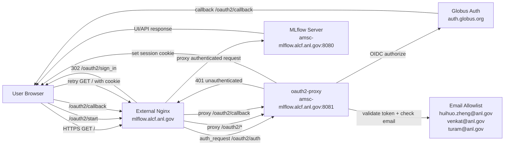

# MLflow + Globus Auth Architecture

This diagram shows the public access and authentication flow for:

- `https://mlflow.alcf.anl.gov`
- `https://mlflow.alcf.anl.gov/oauth2/*`

## Text Schematic (Fallback)

1. Browser requests `https://mlflow.alcf.anl.gov/`.
2. External nginx checks auth with `oauth2-proxy` via `/oauth2/auth`.
3. If unauthenticated, browser is redirected to Globus login.
4. Globus redirects back to `/oauth2/callback`.
5. `oauth2-proxy` validates callback and checks email allowlist.
6. If allowed, `oauth2-proxy` sets session cookie.
7. External nginx forwards authenticated traffic to MLflow on `:8080`.
