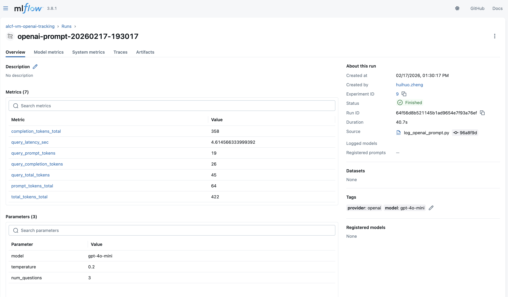
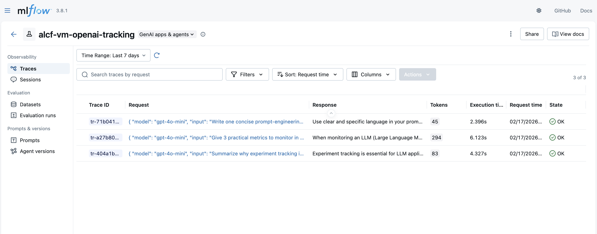

# Prompts Tracing Example

Author: Huihuo Zheng
Email: huihuo.zheng@anl.gov

This example logs OpenAI calls with native MLflow tracing so prompt/response entries appear in the MLflow `Traces` UI.

## Script

- `log_openai_prompt.py`

The script enables tracing via:

- `mlflow.openai.autolog(log_traces=True, silent=True)`

## Code Change Needed To Enable Tracing

If you already have an OpenAI script, the minimum change is to enable MLflow OpenAI autologging before API calls.

Before:

```python
import mlflow
from openai import OpenAI

mlflow.set_tracking_uri("https://mlflow.american-science-cloud.org")
mlflow.set_experiment("my-exp")

client = OpenAI()
response = client.responses.create(model="gpt-4o-mini", input="Hello")
```

After:

```python
import mlflow
from openai import OpenAI

mlflow.set_tracking_uri("https://mlflow.american-science-cloud.org")
mlflow.set_experiment("my-exp")
mlflow.openai.autolog(log_traces=True, silent=True)  # required for Traces UI

client = OpenAI()
response = client.responses.create(model="gpt-4o-mini", input="Hello")
```

Optional for this AmSC setup (if using API key auth and insecure TLS):

```python
os.environ.setdefault("MLFLOW_TRACKING_INSECURE_TLS", "true")
# and inject AM_SC_API_KEY as X-Api-Key header (see log_openai_prompt.py)
```

## Prerequisites

1. Copy env template:

```bash
cp ../.env.example ../.env
```

2. Set required variables in `../.env`:

- `AM_SC_API_KEY`
- `OPENAI_API_KEY`

Optional:

- `MLFLOW_TRACKING_URI`
- `MLFLOW_TRACKING_INSECURE_TLS`
- `OPENAI_MODEL`
- `MLFLOW_EXPERIMENT_NAME`
- `OPENAI_PROMPTS_JSON`

Recommended `../.env` content:

```bash
MLFLOW_TRACKING_URI="https://mlflow.american-science-cloud.org"
MLFLOW_TRACKING_INSECURE_TLS="true"
AM_SC_API_KEY="<your-amsc-api-key>"

OPENAI_API_KEY="<your-openai-api-key>"
OPENAI_MODEL="gpt-4o-mini"
MLFLOW_EXPERIMENT_NAME="alcf-vm-openai-tracking"
# OPENAI_PROMPTS_JSON='["Question 1?", "Question 2?", "Question 3?"]'
```

## Run

```bash
cd ../../
source server/venv/bin/activate
python -m pip install openai
python examples/prompts_tracing/log_openai_prompt.py
```

## What You Should See in MLflow

1. In the experiment `alcf-vm-openai-tracking`, open your latest run.
2. In the run page, open the `Traces` tab.
3. You should see one trace per prompt request, including request payload, response text, token counts, and latency.

### Screenshot: Traces Table

`mlflow-traces-table.png` shows the experiment-level `Traces` page listing multiple trace IDs, request snippets, response snippets, token counts, and status (`OK`).



### Screenshot: Run Overview

`mlflow-run-overview-metrics.png` shows a single run overview with logged metrics/params and the top navigation where the `Traces` tab is available for that run.


